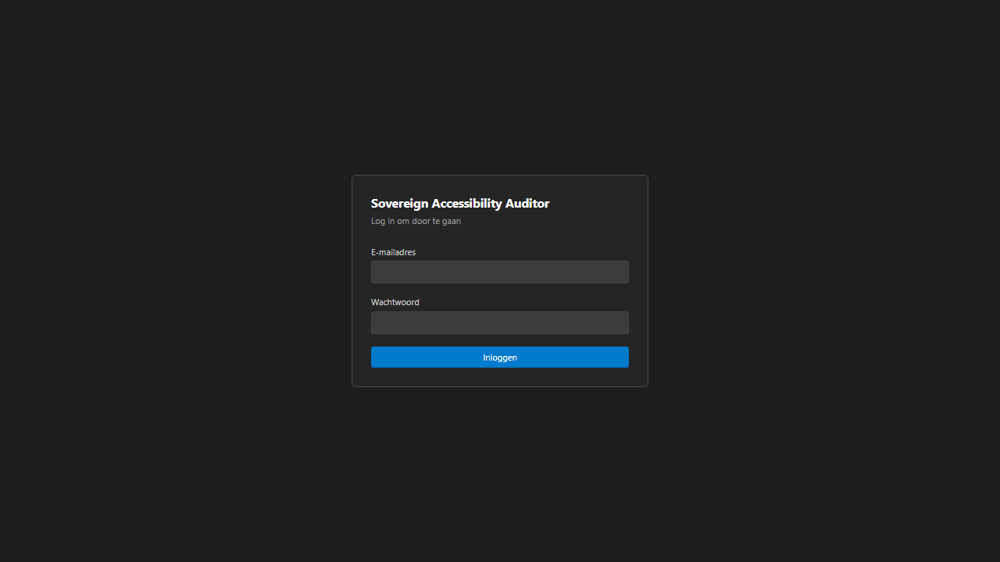
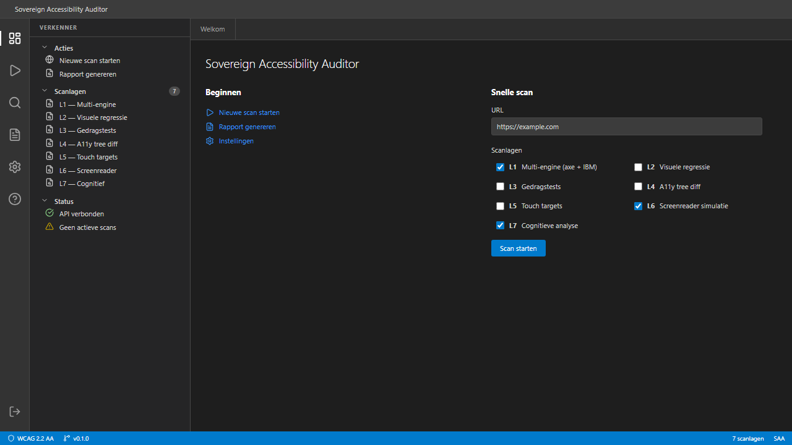
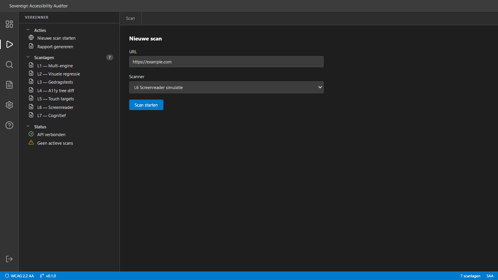
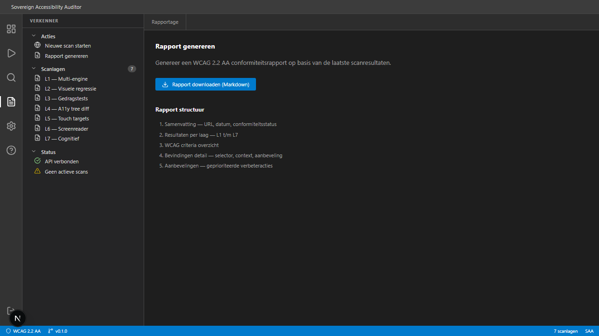
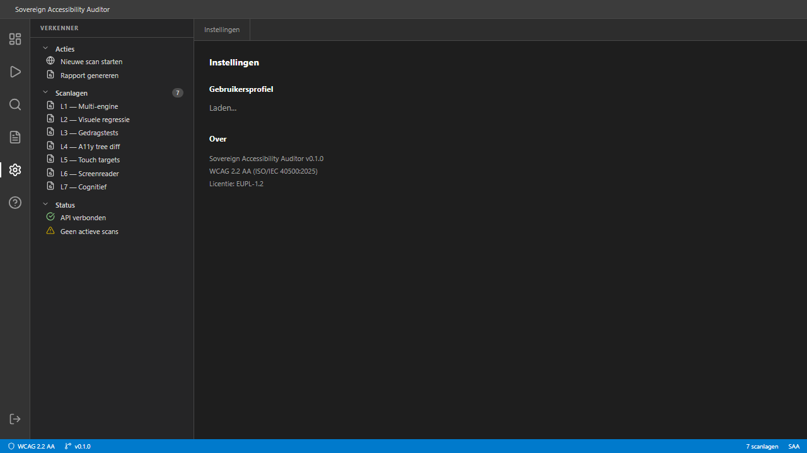
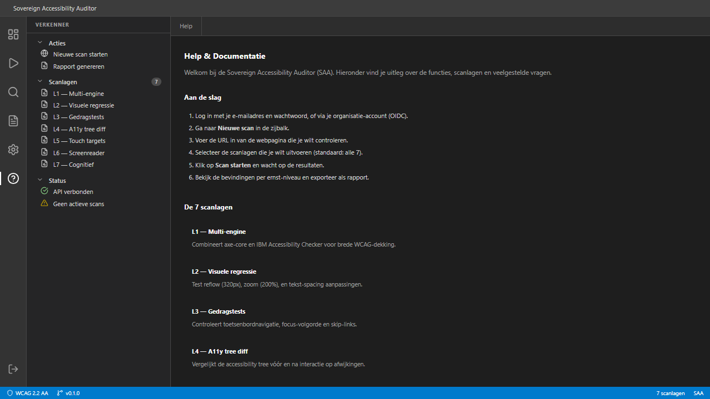

# Gebruikershandleiding — Sovereign Accessibility Auditor (SAA)

## Inhoudsopgave

1. [Inleiding](#inleiding)
2. [Inloggen](#inloggen)
3. [Dashboard](#dashboard)
4. [Nieuwe scan starten](#nieuwe-scan-starten)
5. [Scanlagen](#scanlagen)
6. [Rapportage](#rapportage)
7. [Instellingen](#instellingen)
8. [Help](#help)
9. [Veelgestelde vragen](#veelgestelde-vragen)
10. [Voorbeeld: athide.nl scannen](#voorbeeld-athidenl-scannen)

---

## Inleiding

De Sovereign Accessibility Auditor (SAA) is een open-source platform voor het geautomatiseerd testen van websites op WCAG 2.2 AA-conformiteit (ISO/IEC 40500:2025). Het platform is speciaal ontwikkeld voor Nederlandse gemeenten en overheidsorganisaties.

SAA combineert 7 testlagen voor een dekking van ~65%, aanzienlijk meer dan de ~30% die gangbare tools bieden.

---

## Inloggen

### Credentials login
1. Ga naar de login-pagina van SAA.
2. Vul je **e-mailadres** en **wachtwoord** in.
3. Klik op **Inloggen**.

### Organisatie-account (OIDC)
Als je organisatie Keycloak of een andere OIDC-provider gebruikt:
1. Klik op **Inloggen met organisatie-account**.
2. Je wordt doorgestuurd naar het inlogscherm van je organisatie.
3. Na succesvolle authenticatie keer je automatisch terug naar SAA.

### Beveiliging
- Na 10 mislukte inlogpogingen wordt je account 30 minuten geblokkeerd.
- Sessietokens worden veilig opgeslagen in HttpOnly cookies.
- Wachtwoorden zijn versleuteld met argon2id (geheugen-hard hashing).

---

## Dashboard

Het dashboard is opgebouwd in VS Code-stijl met de volgende onderdelen:

| Onderdeel | Positie | Functie |
|-----------|---------|---------|
| **Titelbalk** | Boven | Naam van de applicatie |
| **Activity Bar** | Links (iconen) | Snel navigeren tussen secties |
| **Zijbalk** | Links (breed) | Verkenner met scanlagen, acties en status |
| **Editor** | Midden | Hoofdinhoud van de huidige pagina |
| **Statusbalk** | Onder | WCAG-versie, app-versie, aantal scanlagen |

### Beginnen
Vanuit het dashboard kun je direct:
- **Nieuwe scan starten** — open de scanpagina
- **Rapport genereren** — ga naar rapportage
- **Instellingen** bekijken — gebruikersprofiel

### Snelle scan
Rechts op het dashboard staat een snelle scan-widget:
1. Voer een URL in (bijv. `https://athide.nl`)
2. Vink de gewenste scanlagen aan
3. Klik **Scan starten**

---

## Nieuwe scan starten

### Stappen
1. Navigeer naar **Nieuwe scan** via de Activity Bar (▷ icoon) of de zijbalk.
2. Voer de volledige URL in, inclusief `https://` (bijv. `https://athide.nl`).
3. Selecteer de scanlagen die je wilt uitvoeren:
   - Standaard zijn L1 (Multi-engine), L6 (Screenreader) en L7 (Cognitief) aangevinkt.
   - Vink extra lagen aan voor uitgebreidere analyse.
4. Klik op **Scan starten**.
5. De resultaten verschijnen zodra elke laag klaar is.

### Tips
- Begin met L1 (Multi-engine) voor een snelle basismeting.
- Voeg L2 (Visuele regressie) toe voor responsiveness-controle.
- L7 (Cognitieve analyse) gebruikt AI en kan langer duren.

---

## Scanlagen

SAA gebruikt 7 complementaire testlagen:

### L1 — Multi-engine (axe-core + IBM Equal Access)
Voert geautomatiseerde WCAG-regels uit met twee engines tegelijk. Detecteert ontbrekende alt-teksten, contrast-fouten, ARIA-fouten en formulier-labels.

### L2 — Visuele regressie
Test hoe de pagina zich gedraagt bij:
- **Reflow** op 320px breedte (WCAG 1.4.10)
- **Zoom** tot 200% (WCAG 1.4.4)
- **Tekst-spacing** aanpassingen (WCAG 1.4.12)

### L3 — Gedragstests
Controleert interactieve toegankelijkheid:
- Toetsenbordnavigatie door alle interactieve elementen
- Focus-volgorde (logisch, zichtbaar)
- Skip-links aanwezigheid en functionaliteit

### L4 — Accessibility tree diff
Vergelijkt de accessibility tree structuur in desktop- en mobiel-viewport. Detecteert elementen die verdwijnen of ontoegankelijk worden op kleinere schermen.

### L5 — Touch targets
Verifieert dat interactieve elementen minimaal 24×24px zijn (WCAG 2.5.8). Markeert te kleine knoppen en links.

### L6 — Screenreader simulatie
Simuleert hoe een screenreader de pagina ervaart:
- Heading-structuur en nesting
- Landmark-regio's
- Alt-tekst kwaliteit
- Link- en knopdoelen

### L7 — Cognitieve analyse
Beoordeelt leesbaarheid en begrijpelijkheid met AI (Ollama + Gemma 3):
- Flesch-Douma leesbaarheidsscore
- Jargon- en vaktaaldetectie
- Zinslengte en complexiteit

---

## Rapportage

### Rapport bekijken
1. Ga naar **Rapportage** via de Activity Bar (📄 icoon).
2. Selecteer een audit uit de lijst.
3. Het rapport toont bevindingen per ernstniveau:

| Ernst | Betekenis |
|-------|-----------|
| **Kritiek** | Blokkeert gebruikers volledig (bijv. geen toetsenbordtoegang) |
| **Hoog** | Ernstige barrière voor bepaalde gebruikersgroepen |
| **Gemiddeld** | Belemmert de gebruikservaring |
| **Laag** | Kleine verbetering mogelijk |

### Exporteren
Klik op **Exporteer als JSON** om het volledige rapport te downloaden. Dit bestand bevat:
- Alle bevindingen met WCAG-criterium, selector en context
- Metadata (datum, URL, viewport, engine)
- Ernst-classificatie per bevinding

---

## Instellingen

Op de instellingenpagina zie je:
- **E-mailadres** — je inloggegevens
- **Naam** — je weergavenaam
- **Rol** — admin, auditor of viewer
- **Gemeente** — de organisatie waaraan je gekoppeld bent

### Rollen

| Rol | Rechten |
|-----|---------|
| **Admin** | Volledige toegang: gebruikers beheren, scans starten, resultaten bekijken |
| **Auditor** | Scans starten en resultaten bekijken |
| **Viewer** | Alleen resultaten inzien |

---

## Help

De help-pagina (bereikbaar via ⓘ in de Activity Bar) bevat:
- **Aan de slag** — stapsgewijze handleiding
- **De 7 scanlagen** — uitleg per laag
- **Veelgestelde vragen** — uitklapbare FAQ
- **Sneltoetsen** — toetsenbordnavigatie-overzicht
- **Links** — WCAG 2.2 specificatie, DigiToegankelijk.nl

---

## Veelgestelde vragen

### Hoe lang duurt een scan?
Afhankelijk van de geselecteerde lagen en de complexiteit van de pagina:
- L1 (Multi-engine): 5-15 seconden
- L2-L5: 10-30 seconden per laag
- L6 (Screenreader): 10-20 seconden
- L7 (Cognitief): 30-60 seconden (AI-verwerking)

### Kan ik meerdere pagina's tegelijk scannen?
Ja. Maak een audit aan met meerdere doel-URL's. SAA verwerkt ze parallel via BullMQ.

### Welke browsers worden ondersteund?
Het dashboard werkt in alle moderne browsers (Chrome, Firefox, Edge, Safari). De scanners gebruiken intern Chromium via Playwright.

### Moet ik Docker gebruiken?
Voor productie: ja, Docker Compose start alle services. Voor alleen het dashboard: `npm run dev` in de packages/dashboard map volstaat.

### Hoe meld ik een bug?
Open een issue op de GitHub-repository met:
1. Stappen om het probleem te reproduceren
2. Verwacht vs. werkelijk resultaat
3. Browser en besturingssysteem

---

## Voorbeeld: athide.nl scannen

Hieronder een voorbeeld van het scannen van [athide.nl](https://athide.nl):

### Stap 1: Inloggen
Open SAA en log in met je credentials.

### Stap 2: URL invoeren
Ga naar **Nieuwe scan** en voer in: `https://athide.nl`

### Stap 3: Lagen selecteren
Voor een volledige audit, vink alle 7 lagen aan:
- ✅ L1 Multi-engine (axe + IBM)
- ✅ L2 Visuele regressie
- ✅ L3 Gedragstests
- ✅ L4 A11y tree diff
- ✅ L5 Touch targets
- ✅ L6 Screenreader simulatie
- ✅ L7 Cognitieve analyse

### Stap 4: Resultaten bekijken
Na afronding zie je per laag de bevindingen, gegroepeerd op ernst:
- **Kritiek**: directe actie vereist
- **Hoog**: plan binnen 2 weken
- **Gemiddeld**: plan binnen kwartaal
- **Laag**: optionele verbeteringen

### Stap 5: Rapport exporteren
Ga naar **Rapportage**, selecteer de scan en klik **Exporteer als JSON**.

---

## Technische informatie

| Eigenschap | Waarde |
|------------|--------|
| Versie | 0.1.0 |
| WCAG-versie | 2.2 AA |
| Norm | ISO/IEC 40500:2025 |
| Licentie | EUPL-1.2 |
| Dashboard | Next.js 15 |
| API | Fastify 5 |
| Database | PostgreSQL 16 |
| Queue | BullMQ op Valkey 8.1 |

---

*Sovereign Accessibility Auditor — EUPL-1.2*
